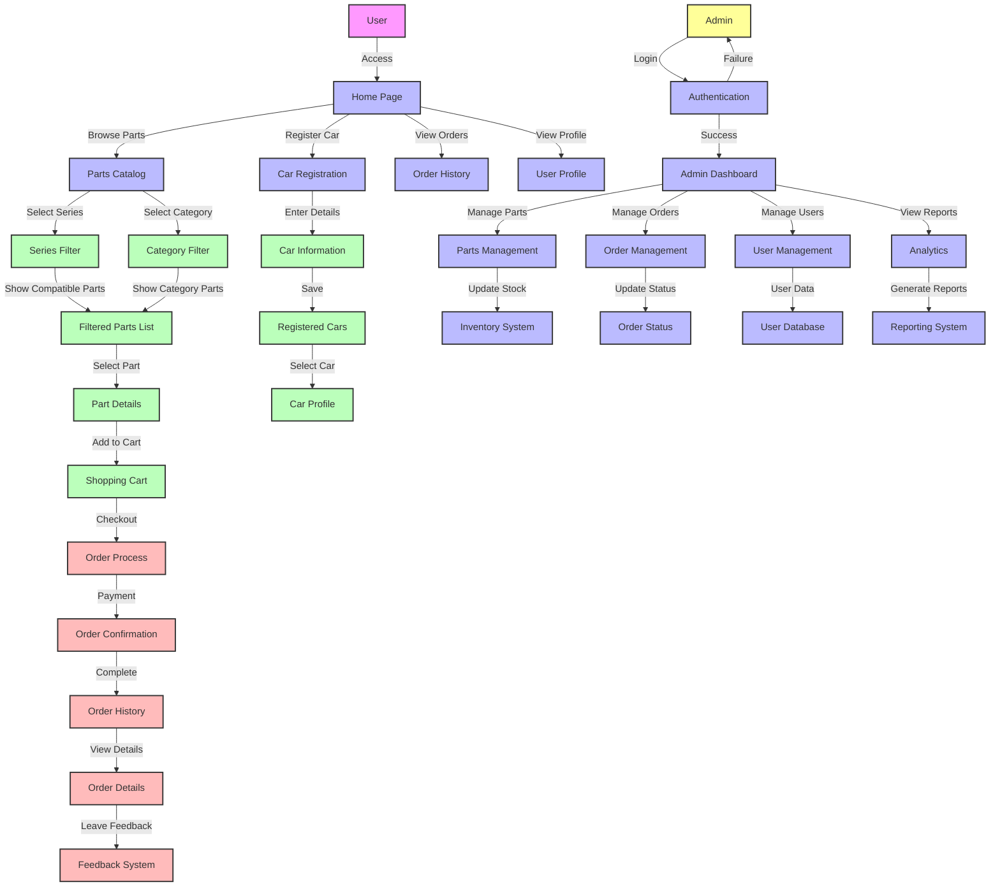

```mermaid
graph TD
    %% User Flow
    A[User] -->|Access| C[Home Page]

    %% Main Navigation Flow
    C -->|Browse Parts| D[Parts Catalog]
    C -->|Register Car| E[Car Registration]
    C -->|View Orders| F[Order History]
    C -->|View Profile| G[User Profile]

    %% Parts Catalog Flow
    D -->|Select Series| H[Series Filter]
    D -->|Select Category| I[Category Filter]
    H -->|Show Compatible Parts| J[Filtered Parts List]
    I -->|Show Category Parts| J
    J -->|Select Part| K[Part Details]
    K -->|Add to Cart| L[Shopping Cart]

    %% Car Registration Flow
    E -->|Enter Details| M[Car Information]
    M -->|Save| N[Registered Cars]
    N -->|Select Car| O[Car Profile]

    %% Order Flow
    L -->|Checkout| P[Order Process]
    P -->|Payment| Q[Order Confirmation]
    Q -->|Complete| R[Order History]
    R -->|View Details| S[Order Details]
    S -->|Leave Feedback| T[Feedback System]

    %% Admin Authentication Flow
    U[Admin] -->|Login| B[Authentication]
    B -->|Success| V[Admin Dashboard]
    B -->|Failure| U

    %% Admin Flow
    V -->|Manage Parts| W[Parts Management]
    V -->|Manage Orders| X[Order Management]
    V -->|Manage Users| Y[User Management]
    V -->|View Reports| Z[Analytics]

    %% System Interactions
    W -->|Update Stock| AA[Inventory System]
    X -->|Update Status| AB[Order Status]
    Y -->|User Data| AC[User Database]
    Z -->|Generate Reports| AD[Reporting System]

    %% Style Definitions
    classDef user fill:#f9f,stroke:#333,stroke-width:2px
    classDef system fill:#bbf,stroke:#333,stroke-width:2px
    classDef process fill:#bfb,stroke:#333,stroke-width:2px
    classDef data fill:#fbb,stroke:#333,stroke-width:2px
    classDef admin fill:#ff9,stroke:#333,stroke-width:2px

    %% Apply Styles
    class A user
    class U admin
    class B,C,D,E,F,G system
    class H,I,J,K,L,M,N,O process
    class P,Q,R,S,T data
    class V,W,X,Y,Z,AA,AB,AC,AD system
``` 